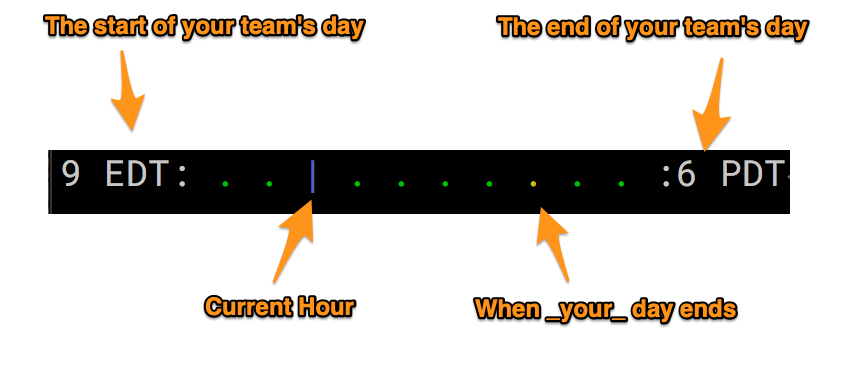

# Day's Progress

Day's Progress is a simple little command line utility to give you a sense of your progress through the day. 

It looks like this (only smaller):



As you can see, it's intended to help people with distributed teams. You configured it by telling it when the earliest riser on your team starts their day, when you end your day, and when the latest riser ends their day. It's ok if some of those times are the same. 

There's a bar the makes its way from left to right as the day progresses. If you end your day before some of your teammates then there will be a little yellow dot for the end of _your_ day. It's intentionally subtle. When integrated into your command line prompt it shouldn't be a source of stress. 

## Usage

After installing and configuring (see below) just run `days_progress` in your terminal. That's it.

I've added it to the line just above my command line prompt. That way there's always a little graph of how far I've progressed in the day, and how much time I have left to coordinate with my remote team members. 


### Notes on colors
The start and end hour labels will be green while you are in than hour. For example. If you start your day at 9:00 EDT (like I do) then the "9:00 EDT" will be green from 9 to 10. In order to encourage you to only work during work hours, the start label will be red if you start working early and the end label will be red if you're working late. The rest of the day they're white.

The progress bar "|" is blue, and progresses across a field of green dots. The exception to this if your end hour is before some of your coworkers. In this case there will be a yelow dot at that hour, and the bar will turn yellow during that hour.

## Installation

### Building from source
Requires [Chicken Scheme](http://call-cc.org/) >= 5.0

Compile it by executing the following lines in your terminal

```sh
# install the required libraries
./install_chicken_eggs.sh
# Now compile the code
csc days_progress.scm
```

Then move the new `days_progress` file somewhere on your [PATH](https://youtu.be/rJMFxIbDe-g).

### Prerequisites
It assumes that the `date` program is avalilable on your system. This
comes by default on linux, macOS, and BSD. 

## Configuration
You want to tell `days_progress` what you consider the start and end of _your_ day to be. 

It uses a simple configuration file that needs to live at 

```
~/.config/days_progress/days_progress_config.scm
```

Mine looks like this. If it looks a little weird to you that's becasue this is actually a tiny bit of Chicken Scheme.

To get started I recommend editing the [days_progress_config.scm](days_progress_config.scm) file in this repository, and then moving it to the location above. Note that hours like `start-hour-local` are in 24hr time and expect integers.

```scheme
(define my-utc-offset -4)
(define start-hour-local 9)
(define my-end-hour-local 17)
(define end-hour-local 21)
(define day-cutover-hour-local 4)
(define start-hour-label "9 EDT")
(define end-hour-label "6 PST")
```

### Here's what each of those means

What is the UTC offset for my current time zone?

```scheme
(define my-utc-offset -4)
```

What hour of the day do I consider the "start" (in my time zone)?

```scheme
(define start-hour-local 9)
```

What hour of the day do I consider the "end" of _my_ day.
This should always be <= end-local-hour.

```scheme
(define my-end-hour-local 17)
```

What hour of the day do I consider the "end" (in my time zone)?

```scheme
(define end-hour-local 21)
```

When does the new "day" start? When working late, midnight is rarely the "end" of the "day". Pick a time that's later than you would ever reasonably stay up. I've chosen 4AM. This must be < `start-hour-local`

```scheme
(define day-cutover-hour-local 4)
```

The labels are for display only. I use
"9 EDT" and "6 PST" because I start work at 9 AM EDT
and my coworkers _end_ their day at 6 PM PST
I could also say "New York" and "California" if 
that felt better.
If you want _no_ labels to be displayed use 
empty strings. E.g. `""`

What label do I want shown at the start of the output?

```scheme
(define start-hour-label "9 EDT")
```
What label do I want shown at the end of the output?

```scheme
(define end-hour-label "6 PST")
```

## Contributing

PRs are happily accepted. Just confirm that the tests in `test.scm` still pass, and any new functionality is covered by new tests. 

Anything that makes this more configurable, or easier to use is heartily welcomed. 
